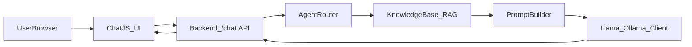

## Llama + RAG + Conversational Agents Plan

### 1. Overall architecture

- **High-level flow**
  - **Frontend** (`frontend/chat.js`): Sends chat messages with current agent selection (e.g., `"faq"`, `"schedule"`, `"staff"`) and conversation history to the backend.
  - **Backend API** (likely existing Django/Flask/FastAPI entry; e.g., [`src/knowledge_base.py`](src/knowledge_base.py) and current chat endpoint): Exposes a `/chat`-style route that:
    - Accepts: `agent_id`, `message`, `history`, optional `session_id`.
    - Performs: RAG retrieval over the existing knowledge base, builds prompts based on `agent_id`, calls Llama via Ollama, and returns the model response (plus any retrieved context snippets for debugging if useful).
  - **RAG layer** (`src/knowledge_base.py` and related code): Reuse current retrieval functions, but:
    - Add an interface that takes `(query, agent_id)` and can:
      - Route to appropriate subsets of documents (e.g., FAQs vs schedule vs staff) based on `agent_id`.
      - Optionally tune retrieval parameters (k, filters) per agent.
  - **LLM client** (new module, e.g. [`src/llm_client.py`](src/llm_client.py)): Simple wrapper around the Ollama HTTP API for chat completion.

### 2. Backend: Llama (Ollama) integration

- **New config & environment**
  - **Add** an environment variable (documented in `docs/README_BRIEF.md`):
    - `LLM_PROVIDER=ollama`
    - `OLLAMA_BASE_URL=http://localhost:11434`
    - `OLLAMA_MODEL=llama3.1:8b` (or similar user-installed tag).
  - **Add** a small configuration helper (e.g. [`src/settings_llm.py`](src/settings_llm.py)) that reads these env vars and exposes them to the rest of the backend.
- **New `llm_client` module**
  - **Create** [`src/llm_client.py`](src/llm_client.py) with:
    - `class LLMClient`: initialized from env/config.
    - `chat(messages: list[dict], temperature: float = 0.3, max_tokens: int = 512) -> str `using the Ollama `/api/chat` endpoint.
    - Simple error handling + timeouts; raise custom `LLMError` on failure.
  - **Design messages format** to be OpenAI-like (role: `system`, `user`, `assistant`) to keep front and back consistent.
- **Wire LLM into existing chat endpoint**
  - Identify the existing chat API handler (likely in Django views or Flask/FastAPI app) and:
    - **Inject** or construct `LLMClient` instance.
    - Replace or augment the current stub/model call with `llm_client.chat(...)` using the RAG-built prompt.
    - Ensure the response JSON has at minimum: `{ "reply": str, "agent_id": str, "sources": [ ... ] }`.

### 3. Backend: RAG + agent routing

- **Reuse and extend `knowledge_base`**
  - Inspect [`src/knowledge_base.py`](src/knowledge_base.py) to:
    - Identify functions that already perform retrieval (e.g., from FAQs, schedule, staff contacts, other docs).
    - **Add** a function `retrieve_for_agent(agent_id: str, query: str) -> list[Document]` that:
      - Maps `agent_id` to appropriate collections or filters (e.g., `"faq"` -> FAQ docs, `"schedule"` -> schedule docs, etc.).
      - Uses existing vector store/indexing logic; no new indexing scheme unless necessary.
- **Prompt building**
  - **Create** a simple prompt-builder in a new module (e.g. [`src/prompt_builder.py`](src/prompt_builder.py)):
    - `build_messages(agent_id, user_message, history, retrieved_docs)` returns a `messages` list for `LLMClient`.
    - Include per-agent system instructions such as:
      - FAQ agent: concise, direct answers, cite FAQs.
      - Schedule agent: focus on `schedule.json`, give specific times.
      - Staff agent: focus on `staff_contacts.json`, avoid fabricating contacts.
    - Inject retrieved snippets with clear delimiters, e.g., `--- Retrieved Context ---`.
- **Multi-agent routing**
  - **Add** an `AgentRegistry` (in [`src/agents.py`](src/agents.py)):
    - Define available agents: `id`, `display_name`, `description`, `system_prompt`, `document_filters`.
    - Provide `get_agent(agent_id)` and `list_agents()` helpers.
  - Chat endpoint:
    - Accepts `agent_id` from frontend.
    - Looks up agent via registry; 400s on unknown agents.
    - Calls `retrieve_for_agent` with agent-specific filters and then `LLMClient`.

### 4. Frontend: multi-agent chat UI

- **Agent selection UI**
  - Update `frontend/chat.js`:
    - **Add** a small agent selector (e.g., dropdown or tabs) with values `faq`, `schedule`, `staff`.
    - Store selected agent in component state; default to `faq` or `general`.
  - Ensure every outgoing chat request payload includes `agent_id`.
- **Chat request shape**
  - Modify the client-side call to `/chat` (or current endpoint) to send:
    - `message`: latest user message.
    - `history`: compacted conversation history in `[ { role, content } ]` format, truncated for context window.
    - `agent_id`: current agent.
    - Optional `session_id` if backend uses it.
  - Display model `reply` in the transcript as usual.
  - Optionally, if backend returns `sources`, show a small expandable "Context used" section per message.

### 5. Tests and validation

- **Backend tests**
  - Extend or mirror tests under [`tests/test_dynamic_features.py`](tests/test_dynamic_features.py) and [`tests/test_static_vs_dynamic.py`](tests/test_static_vs_dynamic.py) to cover:
    - `AgentRegistry` behavior (available agents, defaults, invalid IDs).
    - `retrieve_for_agent` routing to the right subsets of the knowledge base.
    - `build_messages` including correct system prompts and inclusion of retrieved docs.
  - For `LLMClient`, **mock** HTTP requests to the Ollama API so tests don't need a running model.
- **Frontend smoke tests / manual validation**
  - Verify in the browser:
    - Agent selector changes which agent handles the query.
    - FAQ agent pulls FAQ-style answers, schedule agent returns schedule-focused answers, etc.
    - Errors (e.g., LLM offline) are gracefully surfaced to the user in the chat UI.

### 6. Configuration & docs

- **Documentation updates** (`docs/README_BRIEF.md`)
  - Add a new section:
    - **"Running with Llama via Ollama"** including:
      - Install instructions: `ollama install llama3.1` (or chosen tag).
      - Required env vars (as above).
      - Example `curl` or small python snippet using `LLMClient` for sanity checking.
  - Document available agents and what they’re specialized for.
- **Safe fallbacks**
  - If `LLM_PROVIDER` or Ollama is not available:
    - Backend chat endpoint can return a clear error message or fall back to a simple rules-based answer.
    - This behavior should be minimal but explicitly handled so the app doesn’t crash.

### 7. Optional future enhancements (not in first pass)

- **Tool-like behaviors**
  - Allow certain agents (e.g., schedule) to call internal functions to get real-time data (e.g., next session from `schedule.json`) and feed that into RAG/LLM as context.
- **Conversation memory persistence**
  - Store conversation turns in a DB keyed by `session_id` instead of passing full history from the frontend.
- **Per-agent temperature and style**
  - Configure temperature, max tokens, and style per agent in `AgentRegistry` and propagate to `LLMClient`.